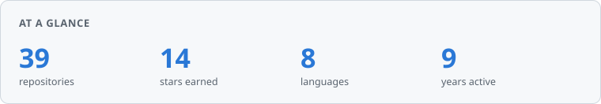
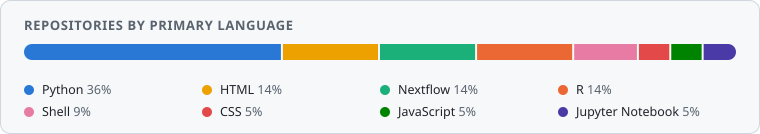
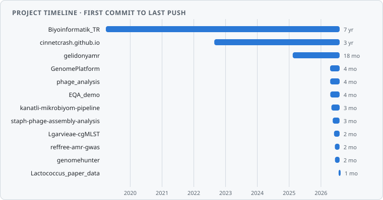

# Gültekin Ünal

Veterinarian (DVM, PhD) working in microbiology and bioinformatics at Ankara
University, Faculty of Veterinary Medicine (Department of Microbiology). My work
sits where clinical and veterinary microbiology meets genomics: **bacteriophage
genomics**, **antimicrobial resistance surveillance**, and **whole-genome
sequencing of bacterial isolates** — mostly as reproducible Nextflow and
Snakemake pipelines.

<picture>
  <source media="(prefers-color-scheme: dark)" srcset="assets/stats-dark.svg">
  
</picture>

#### &#127793; Currently working on

<h3><a href="https://github.com/cinnetcrash/phage_analysis">phage_analysis</a> &#11088;3</h3>

Nextflow DSL2 pipeline for bacteriophage discovery and characterisation — fastp, Kraken2, SPAdes, VirSorter2, CheckV, BACPHLIP, Pharokka, vContact2

#### &#9889; All projects

  
<b>Pipelines &amp; tools</b> &mdash; 4 repositories

   
  <h4><a href="https://github.com/cinnetcrash/gelidonyamr">gelidonyamr</a> &#11088;3</h4>
  
Nextflow pipeline for <i>Salmonella</i> Infantis: assembly, AMR profiling, plasmid detection, MLST/cgMLST typing

  <h4><a href="https://github.com/cinnetcrash/reffree-amr-gwas">reffree-amr-gwas</a></h4>
  
Reference-free AMR GWAS — unitig-based <code>pyseer</code> mixed model that flags novel resistance determinants and scores their phylogenetic mobility

  <h4><a href="https://github.com/cinnetcrash/kanatli-mikrobiyom-pipeline">kanatli-mikrobiyom-pipeline</a> &#11088;1</h4>
  
Nanopore metagenomics for poultry gut microbiome (Nextflow DSL2 + Kraken2)

  <h4><a href="https://github.com/cinnetcrash/GenomePlatform">GenomePlatform</a> &#11088;3</h4>
  
FastAPI platform running a bacterial genome analysis chain end to end, with AI-assisted reporting and PCR primer design <i>(research use only)</i>

  
<b>Data &amp; schemas</b> &mdash; 3 repositories

   
  <h4><a href="https://github.com/cinnetcrash/Lgarvieae-cgMLST">Lgarvieae-cgMLST</a></h4>
  
chewBBACA-compatible core-genome MLST schema for <i>Lactococcus garvieae</i> — 1100 loci from 247 QC'd genomes

  <h4><a href="https://github.com/cinnetcrash/Lactococcus_paper_data">Lactococcus_paper_data</a></h4>
  
Supplementary data and figure code for the <i>L. garvieae</i> / rainbow trout characterisation paper

  <h4><a href="https://github.com/cinnetcrash/staph-phage-assembly-analysis">staph-phage-assembly-analysis</a></h4>
  
Assembly and characterisation outputs for <i>S. aureus</i> bacteriophage isolates

  
<b>Teaching &amp; outreach</b> &mdash; 4 repositories

   
  <h4><a href="https://github.com/cinnetcrash/cinnetcrash.github.io">cinnetcrash.github.io</a> &#11088;1</h4>
  
Bilingual (TR/EN) microbial bioinformatics training curriculum

  <h4><a href="https://github.com/cinnetcrash/EQA_demo">EQA_demo</a></h4>
  
Interactive WGS outbreak investigation built on a CRAB EQA exercise — teaching scenario

  <h4><a href="https://github.com/cinnetcrash/genomehunter">genomehunter</a></h4>
  
Browser game teaching kids the bioinformatics pipeline, DNA → genome

  <h4><a href="https://github.com/cinnetcrash/Biyoinformatik_TR">Biyoinformatik_TR</a> &#11088;1</h4>
  
Turkish-language bioinformatics training material

  
<b>No longer maintained</b> &mdash; 4 repositories

   
  <h4><a href="https://github.com/cinnetcrash/2025_NGS_Exercise_Club">2025_NGS_Exercise_Club</a> &#128721; archived</h4>
  
NGS exercise club material. <i>Archived — did not go past the outline.</i>

  <h4><a href="https://github.com/cinnetcrash/consensus_printer">consensus_printer</a> &#128721; archived</h4>
  
Reference-based consensus caller for SARS-CoV-2. <i>Archived — written in Nextflow DSL1, which Nextflow 22.12+ can no longer run.</i>

  <h4><a href="https://github.com/cinnetcrash/WGS_Training">WGS_Training</a> &#128721; archived</h4>
  
<i>Archived — placeholder that never got content.</i>

  <h4><a href="https://github.com/cinnetcrash/python_kodlari">python_kodlari</a> &#128721; archived</h4>
  
Early Python practice files. <i>Archived — superseded by <a href="https://github.com/cinnetcrash/inhouse-scripts">inhouse-scripts</a>.</i>

#### &#127760; Live sites

| Page | URL |
|---|---|
| [Training curriculum](https://cinnetcrash.github.io/) | https://cinnetcrash.github.io/ |
| [CRAB outbreak investigation](https://cinnetcrash.github.io/EQA_demo/) | https://cinnetcrash.github.io/EQA_demo/ |
| [GenomeHunter](https://cinnetcrash.github.io/genomehunter/) | https://cinnetcrash.github.io/genomehunter/ |

<picture>
  <source media="(prefers-color-scheme: dark)" srcset="assets/languages-dark.svg">
  
</picture>

<picture>
  <source media="(prefers-color-scheme: dark)" srcset="assets/timeline-dark.svg">
  
</picture>

**Working with:** Nextflow · Snakemake · Python · R · Docker / Singularity · Bakta · Prokka · chewBBACA · pyseer · Kraken2 · CheckV

📫 gultekinnunal@gmail.com · 🆔 [ORCID 0000-0002-8996-7028](https://orcid.org/0000-0002-8996-7028)

<b>Türkçe</b>

 

Ankara Üniversitesi Veteriner Fakültesi Mikrobiyoloji Anabilim Dalı'nda
mikrobiyoloji ve biyoinformatik alanında çalışan bir veteriner hekimim (DVM, PhD).
Çalışma alanlarım **bakteriyofaj genomiği**, **antimikrobiyal direnç sürveyansı**
ve **klinik bakteriyel tam genom dizileme** — ağırlıklı olarak yeniden
üretilebilir Nextflow ve Snakemake iş akışları biçiminde.

Türkçe biyoinformatik eğitim modülleri için
[cinnetcrash.github.io](https://cinnetcrash.github.io/) adresine bakabilirsiniz.
Katkı, hata bildirimi ve iş birliği önerilerine açığım.

Generated by [`build_profile.py`](build_profile.py) on 2026-09-07.
